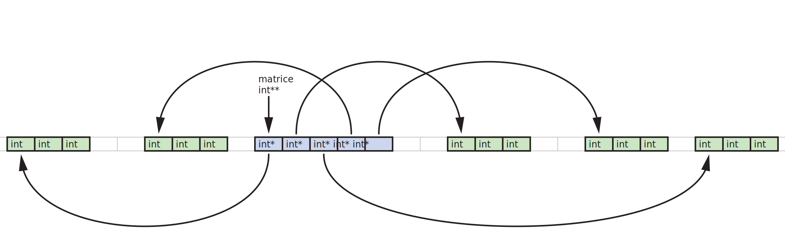

# TD2 - Manipulations de tableaux en C

## Minmax

1. Écrivez une fonction `int maximum(int *t, int n)` qui prend en argument un tableau `t` contenant des entiers et un entier `n` correspondant au nombre de cases du tableau et qui renvoie la valeur du plus grand élément du tableau.
    **Remarque :** On peut supposer que le tableau n'est pas vide, mais il faut tenir compte du fait qu'il peut contenir des valeurs négatives.

2. Pourquoi doit-on donner la taille du tableau en paramètre de la fonction ?

On veut maintenant écrire une fonction qui calcule à la fois le maximum et le minimum d'un tableau d'entiers. Le problème est qu'une fonction en C ne peut renvoyer qu'un seul objet à la fois. Pour récupérer les deux valeurs calculées, il faut soit les mettre toutes les deux dans un même objet qui sera renvoyé par la fonction, soit dire à la fonction de mettre les valeurs calculées à des emplacements de la mémoire où l'on pourra les récupérer par la suite.

Considérons la fonction suivante qui calcule à la fois la somme et le produit de deux entiers :
```C
void f(int a, int b, int *s, int *p) {
    *s = a + b;
    *p = a * b;
}
```

3. Expliquez ce qui se passe lorsque l'on éxécute le code suivant (dans la fonction `main` du programme par exemple) :
    ```C
    int x, y;
    f(12, 4, &x, &y);
    printf("x = %d, y = %d\n", x, y);
    ```

4. Écrivez une fonction `void minmax(int *t, int n, int *pmin, int *pmax)` qui trouve le minimum et le maximum d'un tableau d'entiers et place les résultats aux emplacements indiqués par les pointeurs `pmin` et `pmax`.

5. Testez votre fonction en créant un tableau contenant 10 valeurs entières et en affichant à l'écran le maximum et le minimum.

## Création dynamique de tableaux

Lorsqu'une fonction est appelée dans un programme, elle dispose d'un espace en mémoire spécifique pour stocker les variables déclarées au cours de son exécution. Lorsque la fonction se termine, toutes ces variable (appelées variables *locales*) sont supprimées de la mémoire. L'espace dans lequel sont placées ces variables locales est couramment appelé *pile* (le terme officiel en C est *stockage automatique*), tandis que le reste de la mémoire utilisable par le programme est appelé *tas* (le terme officiel étant *stockage dynamique*).
	
Jusqu'ici nous n'avons utilisé que la pile, puisque toutes les variables étaient automatiquement allouées, mais nous allons voir comment utiliser l'allocation dynamique pour créer des variables dans le tas.

On cherche à écrire une fonction `int* copie(int *tab, int n)` qui prend en argument un tableau d'entiers et sa taille et renvoie une copie de ce tableau, c'est-à-dire un tableau se trouvant à un autre emplacement en mémoire mais contenant les mêmes valeurs.
	
On considère la fonction suivante :
```C
int* copie(int *tab, int n) {
	int tab2[n];
	for (int i = 0; i < n; i++) {
		tab2[i] = tab[i];
	}
	return tab2;
}
```
6. Recopiez et compilez cette fonction. Essayez de comprendre le message d'alerte du compilateur.

Pour résoudre ce problème, on pourrait passer en argument de la fonction un pointeur vers un emplacement de mémoire réservé à l'avance, comme on l'a fait précédemment, mais une autre solution consiste à allouer un espace mémoire dans le tas, qui ne sera donc pas libéré à la fin de la fonction.
	
Pour cela, on utilise la fonction `malloc` qui prend comme argument la taille de la mémoire à allouer (en octets) et renvoie l'adresse d'un pointeur vers cet espace. Ainsi, si l'on veut assez de place pour stocker *n* objets de type `int`, on peut utiliser la syntaxe<sup id="fnb_1">[1](#fn_1)</sup> :
```C
int *p;
p = malloc(sizeof(int) * n);
```
Notez que l'on utilise l'instruction `sizeof` pour déterminer l'espace mémoire occupé par un entier, ce qui permet de rester compatible entre les systèmes qui ne codent pas nécessairement les `int` sur le même espace, et permet aussi de ne pas avoir à se poser la question.
	
7. Réécrivez la fonction `copie` en utilisant une allocation dynamique pour la variable `tab2`. Compilez et vérifiez que tout se passe bien.

8. Écrivez une fonction `int* unsurdeux(int *tab, int n)` qui renvoie un tableau contenant les éléments de `tab` se trouvant aux indices pairs.

Lorsque l'on utilise la fonction `malloc` pour réserver de l'espace en mémoire, cet espace n'est pas libéré automatiquement pendant l'exécution du programme. Si votre programme alloue beaucoup de variables à l'aide de la fonction `malloc`, vous devez libérer cet espace manuellement lorsqu'il n'est plus utilisé à l'aide la fonction `free`. Si on ne libère pas l'espace, on provoque une *fuite de mémoire* qui fait que le programme utilise de plus en plus de mémoire au cours de son exécution (au lieu de réutiliser l'espace dont il n'a plus besoin).

La fonction `free` prend simplement en argument l'adresse d'un segment qui a été alloué par la commande `malloc`. On pourrait par exemple avoir la fonction `main` suivante :
```C
int main() {
	int tab[10] = {1, 2, 3, 4, 5, 6, 7, 8, 9};
	int *tab_bis;
	
	tab_bis = unsurdeux(tab, 10);
	for (int i = 0; i < 5; i++) {
		printf("%d ", tab_bis[i]);
	}
	printf("\n");
	free(tab_bis);
}
```
qui libère bien l'espace occupé par la variable `tab_bis`. Cependant, tout l'espace utilisé par le programme (pile et tas) est libéré à la fin de celui-ci, et dans cet exemple il n'est donc pas réellement nécessaire de libérer l'espace à la fin de la fonction `main`...

## Matrices
	
On va maintenant s'intéresser à la manipulation de matrices, sous la forme de tableaux bi-dimensionnels. Le langage C ne prévoit pas de type particulier pour les tableaux à plusieurs dimensions, le moyen le plus naturel est donc de les représenter sous la forme de tableaux de tableaux.
	
Ainsi, une matrice *n* x *m* (*n* lignes et *m* colonnes) sera un tableau contenant *n* tableaux, contenant à leur tour *m* entiers chacun. Donc dans les cases du premier tableau, il y a des pointeurs, qui pointent au début d'un tableau d'entiers. Un tableau d'entiers bidimensionnels est donc un objet de type `int**` puisqu'il pointe sur des éléments de type `int*`. La figure suivante illustre la représentation d'une matrice 5 x 3 en mémoire :



Dans un tel tableau, si l'on veut accéder à l'élément se trouvant sur la ligne 2 et en colonne 3, on peut appeler `m[2][3]`. En effet, `m[2]` désigne le tableau correspondant à la ligne 2, et donc `m[2][3]` est l'élément à l'indice 3 dans la ligne 2.

Pour rendre les choses un peu plus propres, on va ajouter à ce tableau deux entiers indiquant les dimensions de la matrice. L'ensemble des données sera mémorisé dans une structure :
```C
struct Matrice {
	int nb_lignes;
	int nb_colonnes;
	int **valeurs;
}
```

9. Écrivez une fonction `void affiche(struct Matrice)` qui affiche à l'écran la matrice passée en argument.
    **Indication :** Pour chaque ligne de la matrice, il faut afficher les éléments suivis d'un espace, puis à la fin de la ligne afficher un retour à la ligne. Pour que tous les coefficients de la matrice occupent la même place indépendamment du nombre de chiffres (ou du signe négatif éventuel) vous pouvez utiliser le code `%3i` dans la fonction `printf` qui affiche la valeur d'un entier en occupant au moins 3 caractères (complété automatiquement par des espaces).

Actuellement, il est très fastidieux de définir une nouvelle matrice. En effet, il faut définir un tableau pour chacune des lignes, puis un tableau contenant des pointeurs sur des entiers dans lequel on place chacun des tableaux précédents. Par exemple, pour définir une matrice 2 x 3, on peut écrire
```C
int l1[3] = {1, 2, 3};
int l2[3] = {4, 5, 6};
int *v[2] = {l1, l2};
struct Matrice m = {
	.nb_lignes = 2,
	.nb_colonnes = 3,
	.valeurs = v,
};
```

Pour se simplifier la vie, on va écrire une fonction `struct Matrice matrice(int nbl, int nbc, int *valeurs)` qui prendra comme arguments les dimensions d'une matrice et un unique tableau contenant toutes les valeurs à la suite (dans l'ordre de lecture usuel), et qui fabriquera la matrice et la renverra.

Cette fonction va donc devoir créer un tableau contenant les pointeurs de chaque ligne ainsi qu'un tableau pour chaque ligne, contenant des entiers. Tous les tableaux doivent être alloués dynamiquement (avec la fonction `malloc`). Les valeurs des coefficients passés en argument de la fonction doivent être placés dans les tableaux représentant les lignes, et ces tableaux doivent ensuite être placés dans le tableau principal.

Enfin, lorsque le tableau bidimensionnel est prêt, il faut créer l'objet de type `struct Matrice`, remplir ses champs et renvoyer le tout.

10. Écrivez la fonction `struct Matrice matrice(int nbl, int nbc, int *valeurs)`.
	**Indication :** La taille à allouer au tableau principal est `nbl * sizeof(int*)`, et la taille de chacun des tableaux correspondant à une ligne est `nbc * sizeof(int)`.

11.	Testez la fonction précédente à l'aide du code suivant :
```C
int v1[12] = {
	1, 2, 3, 4,
	2, 4, 6, 8,
	3, 6, 9, 12,
};
struct Matrice m1 = matrice(3, 4, v1);
affiche(m1);
```

Les matrices produites par la fonction `matrice` contiennent des tableaux alloués dynamiquement. Lorsque l'on n'a plus besoin d'une matrice, il faut libérer manuellement l'espace qu'elle occupe. Pour cela, il faut libérer l'espace occupé par chacun des tableaux représentant les lignes, puis l'espace occupé par le tableau principal.

12. Écrivez la fonction `void efface(struct Matrice)` qui libère l'espace occupé par une matrice dont les tableaux ont été alloués dynamiquement<sup id="fnb_2">[2](#fn_2)</sup>.

13. Écrivez une fonction `struct Matrice multiplie(struct Matrice m1, struct Matrice m2)` qui calcule le résultat de la multiplication matricielle des matrices `m1` et `m2` (on suppose que le nombre de colonnes de `m1` est égal au nombre de lignes de `m1`).
	**Indication :** Il faut encore une fois créer une nouvelle matrice dont les tableaux sont alloués dynamiquement (de dimensions `m1.nb_lignes` x `m2.nb_colonnes`) et calculer chacun des coefficients en appliquant la règle de multiplication des matrices (il y a trois boucles imbriquées à faire).

---
Notes :

<b id="fn_1">1.</b> Si l'on veut vraiment bien faire, il est conseillé d'utiliser la syntaxe `p = malloc(sizeof(*p) * n);` qui a le mérite de ne pas faire apparaître explicitement le type de `p`, ce qui permet de le changer plus tard sans avoir à modifier la ligne. [↩](#fnb_1)

<b id="fn_2">2.</b> Attention, il ne faut pas utiliser cette fonction avec une matrice dont les tableaux ont été alloués automatiquement, comme c'était le cas pour la matrice définie avant la question 10. [↩](#fnb_2)